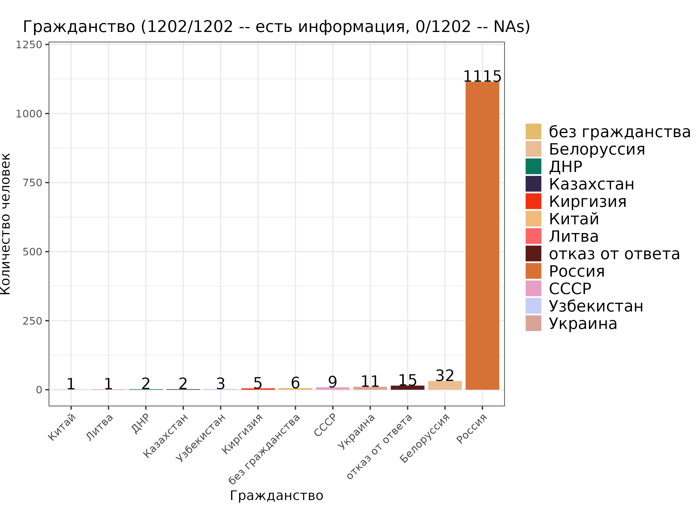
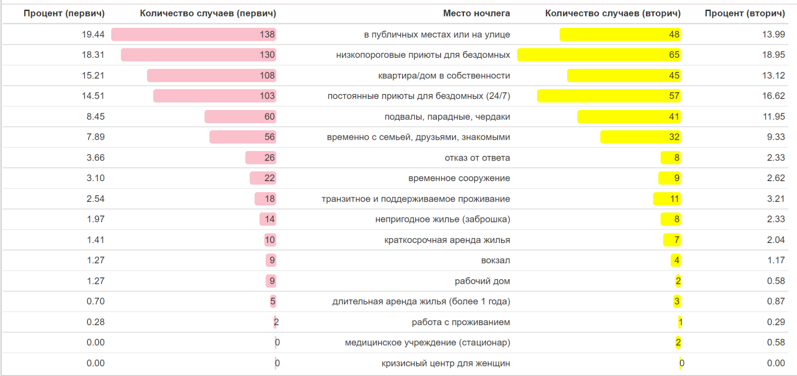
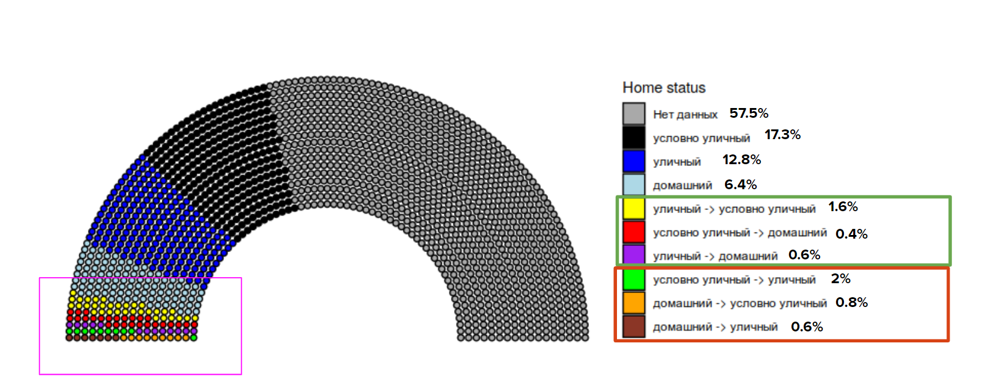

# Analysis of the "Charity hospital" database

Authors:
- Ekaterina Fokina
- Eugene Potapenko
- Mariia Firuleva
- Liliya Golubnikova

## Introduction
The [Charity Hospital](https://charityhospital.ru/) is a non-profit organization that provides comprehensive medical and social assistance to the homeless, migrants, refugees, and people without documents and citizenship since 2018.  

Data was recorded and managed with the REDCap system, a secure, web-based application designed to support data capture for research studies. The REDCap system is collecting data on every homeless patient who seeks medical help. This is a unique practice for Russia and the analysis of the collected data (1633 unique patients) will help to improve service for homeless people in protecting their health.

## Aim, tasks and data
The aim of this project was to perform the database analysis and identify the patterns in the incidence (morbidity) of homeless patients.

Tasks:
1. describe the portrait of a homeless patient
2. determine the influence of the place of sleeping on the presence of any disease
3. cluster homeless patients by places of assistance and identify specific charactercistics of these clusters (health and socio-economic indicators)
4. identify the relationship between calling an ambulance (AMS) and the state of the homeless patient, build a predictive model for calling an ambulance

## Results

### The portrait of a homeless patient

#### Age and gender   

#### Citizenship

#### Documents

#### Family status and education 

### The most common diseases of the homeless people   

#### DS-ICD №10 disease categories

#### Social diseases

- HIV

- Hepatit B, C, lues

### The categories of homeless people by place of sleeping 
 

Here you can see statistic distribution of the homeless people among place of sleeping at their first and last visit:         
  

We analyzed how changed the conditions of living of the Charity Hospital patients.      

*Conclusion:*  The number of patients whose place of living has improved is only 43 (2.6%).   
At the same time, the number of patients whose place of living became worse was 55 (3.4%).   

**Categories of homeless people**    

For the further analysis we grouped patients by places of living in the following categories:   
- Chronic Homelessness (street) 
- Hidden Homelessness
- Domestic Homelessness

    

### The influence of the place of sleeping on the presence of any disease

*Here we analyzed the distribution of DS-ICD №10 disease categories, socially significant infections (hepatit B, C, syphilis, HIV), alcohol addictions, tuberculosis among different categories of homeless people. In addition we calculated multiple Chi-square test for some pairs with statistically relevant number of observations (not less than 30).*         

**Categories of homeless people and DS-ICD №10 disease categories**  

*Multiple Chi-square test*   
Hypothesis: Is the distribution of ICD-10 among different categories of homelessness non-random.    
*Adjusted p-value =  0.003*    

Revealed dependency:
Disease of the circulatory system, I00-I99 (p-value = 0.000284)    

**Categories of homeless people and tuberculosis**    

**Categories of homeless people and addictions**     
*Multiple Chi-square test*   
Hypothesis: There is an association between the type of homelessness and the presence of addiction.    
Conclusion: Alcohol addiction is associated with a type of homelessness (p-value = 1.21e-08).   

*Adjusted p-value = 0.0125*    

###  The categories of homeless patients by places of assistance and test of independence
*Here we grouped places of assistance according with international categories: parking, shelter, night shelter, remote consultation, heating point, medical center.*    

**Places of assistance and DS-ICD №10 disease categories**   

*Conclusion:*  most visits of patients were at the parking places, so neither factor showed the significance different between different places of assistance.   

## References
- [Smoking Among Chronically Homeless Adults: Prevalence and Correlates, Jack Tsai, Ph.D., and Robert A. Rosenheck, M.D.](https://ps.psychiatryonline.org/doi/full/10.1176/appi.ps.201100398)
- [A retrospective analysis of the health and social situation of homeless people in Berlin: study protocol, Sonia Lech, Liane Schenk, Jenny De la Torre Castro & Daniel Schindel](https://archpublichealth.biomedcentral.com/articles/10.1186/s13690-021-00546-y)

