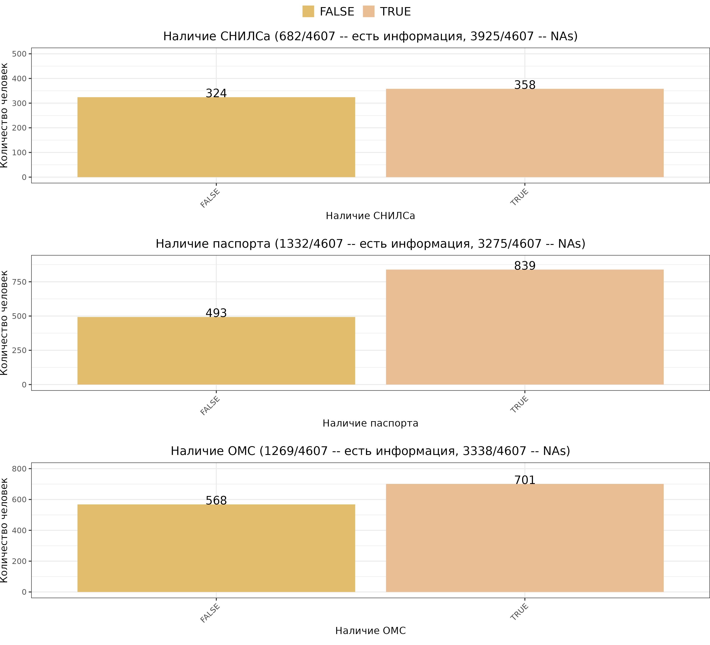
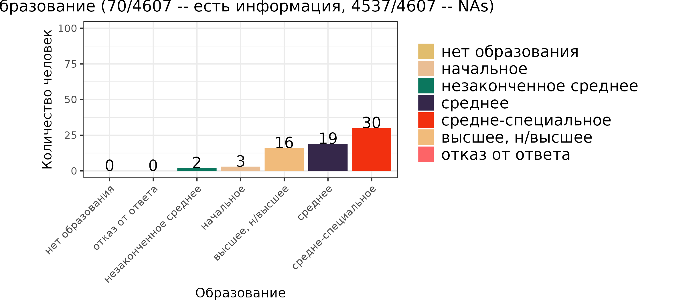

# Analysis of the "Charity hospital" database

Authors:
- Eugene Potapenko
- Mariia Firuleva
- Liliya Golubnikova

## Introduction
The [Charitable Hospital](https://charityhospital.ru/) is a non-profit organization that provides comprehensive medical and social assistance to the homeless, migrants, refugees, and people without documents and citizenship since 2018.  

Data was recorded and managed with the REDCap system, a secure, web-based application designed to support data capture for research studies. The REDCap system is collecting data on every homeless patient who seeks medical help. This is a unique practice for Russia and the analysis of the collected data (1633 unique patients) will help to improve service for homeless people in protecting their health.

## Aim, tasks and data
The aim of this project was to perform the database analysis and identify the patterns in the incidence (morbidity) of homeless patients.

Tasks:
1. describe the portrait of a homeless patient
2. determine the influence of the place of sleeping on the presence of any disease
3. cluster homeless patients by places of assistance and identify specific charactercistics of these clusters (health and socio-economic indicators)
4. identify the relationship between calling an ambulance (AMS) and the state of the homeless patient, build a predictive model for calling an ambulance

## Results

### The portrait of a homeless patient

- age and gender

- citizenship

- documents

- family status and education 

### The influence of the place of sleeping on the presence of any disease

*Here we analyzed the distribution of DS-ICD №10 illness categories, socially significant infections (hepatit B, C, syphilis, HIV), alcohol addictions, tuberculosis among different categories of homeless people. In addition we calculated multiple Chi-square test for some pairs with statistically relevant number of observations (not less than 30).*         

**Categories of homeless people**   

**Categories of homeless people with visit frequencies**      

**Categories of homeless people and DS-ICD №10 illness categories**  

**Categories of homeless people and tuberculosis**    

**Categories of homeless people and addictions**     
*Multiple Chi-square test*   
Hypothesis: There is an association between the type of homelessness and the presence of addiction.    
Conclusion: Alcohol addiction is associated with a type of homelessness (p-value = 1.21e-08).   

*Adjusted p-value = 0.0125*    

### Clusterization of homeless patients by places of assistance

## References
- [Smoking Among Chronically Homeless Adults: Prevalence and Correlates, Jack Tsai, Ph.D., and Robert A. Rosenheck, M.D.](https://ps.psychiatryonline.org/doi/full/10.1176/appi.ps.201100398)
- [A retrospective analysis of the health and social situation of homeless people in Berlin: study protocol, Sonia Lech, Liane Schenk, Jenny De la Torre Castro & Daniel Schindel](https://archpublichealth.biomedcentral.com/articles/10.1186/s13690-021-00546-y)

